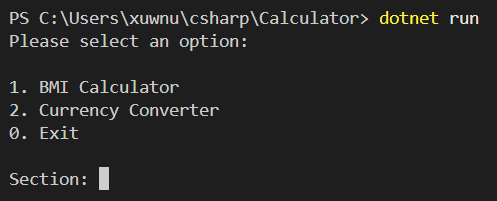
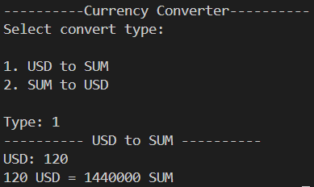
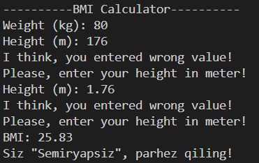

# Calculator

This project includes some calculation options, such as the `Currency Calculator` and the `BMI Calculator`.

Have a look at `Program.cs` file and you can see how i have used:

* System input/output
* Arithmetic operations
* Conversation between data types

## Image

> ## Currency Calculator
> I have created `CurrencyCalculator()` method in `Program.cs` file and you can use to calculate between `USD to SUM` or `SUM to USD`. I used `1 dollar = 12,000 sum`
> ## Image
>

> ## BMI Calculator
> I have another `BMICalculator()` method in `Program.cs` file. This method can calculate your BMI. In this method I have used this formula: `BMI = weight(kg) / [height(m)]²`
> ## Image
>

# Thank you for your attention.

